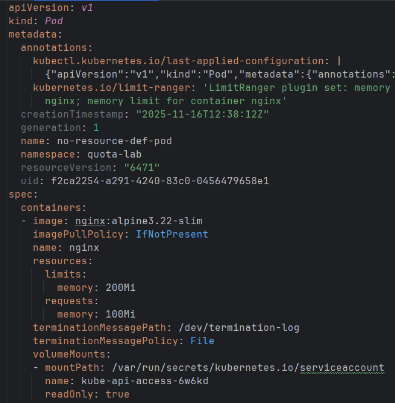
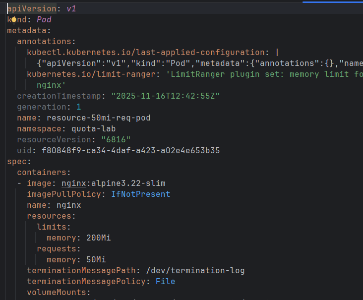
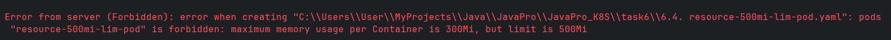
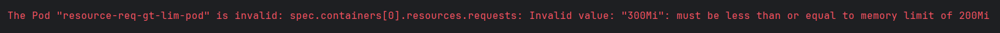

# Задание №3 по курсу JavaPRO Модуль 2

## Теория

- Pod
: Базовая единица в кубере, представляет собой неделимую сущность, содержащую контейнеры докера и управляющая ими, как 
одним целым.

- ReplicaSet
: Сущность, отвечающая за контроль над запущенными подами. Контролирует, чтобы в каждый момент времени количество подов 
соответствовало заданному.

- Deployment
: Отвечает за управление развёртыванием подов в пространстве кубера. Управляет политикой развёртывания подов.

- Почему Pod без контроллера не восстанавливается после удаления?
: Потому что в зону ответственности пода входит только управление контейнерами внутри, но не контролем за существованием
себя в пространстве кубера

- Как Deployment понимает, какие Pod ему принадлежат?
: Через selector\`ы, с помощью label\`ов

- Что делает стратегия RollingUpdate?
: Последовательно выводит из работы старые версии подов запуская новые. Параметры: maxSurge - насколько больше подов 
может быть в момент обновления, maxUnavailable - сколько подов во время обновления будет недоступно 

- В чём разница между ReplicaSet и Deployment?
: Репликасет отвечает за управление и контроль за подами, деплоймент - грубо говоря, за создание новых репликасетов и 
контроль за развёртыванием новых подов

- Что произойдёт, если selector не совпадает с метками в template?
: Возникнет ошибка `selector does not match template labels`, поды не будут созданы.

## Задача 1

K8S развёрнут на базе Docker Desktop

## Задача 2

Подготовлен манифест пода: [Манифест](task3/task-2-simple-pod.yaml)

## Задача 3

Манифест применён, под запущен: [Результат выполнения манифеста](task3/task-3-simple-pod-deployment-result.yaml)

## Задача 4

### Удаление пода
До удаления:   

После удаления:   

## Задача 5

Деплоймент: [Манифест](task3/task-5-deployment-and-svc.yaml)

Результат:   

## Задача 6

Результат теста запущенного через деплоймент приложения:   

## Задача 7

Удаляем под, ожидаем, что создастся новый

До:   

После:   

## Задача 8

Масштабирование до 3 реплик и обратно на 1

Replica count = 3:   

Replica count = 1:   
## Задача 9

Обновление версий образа в деплойменте

До:   

После:   

# Задание №4 по курсу JavaPRO Модуль 2

## Задача 1

Манифест: [1. daemon-set.yaml](task4/1.%20daemon-set.yaml)

Результат:

## Задача 2

Манифест: [2. stateful-set.yaml](task4/2.%20stateful-set.yaml)

Результат:

## Задача 3
Манифест: [3. job.yaml](task4/3.%20job.yaml)

Результат: 

## Задача 4
### 4.1

Манифест: [4.1. cronjob.yaml](task4/4.1.%20cronjob.yaml)

Результат: 

### 4.2

Манифест: [4.2. second cronjob.yaml](task4/4.2.%20second%20cronjob.yaml)

Результат:

### 4.3

kubectl create job --from=cronjob/cronjob-test-2 manual-job-from-cronjob-2

Результат:

# Задание №5 по курсу JavaPRO Модуль 2

## 5.1 - 5.2
[5.1-2 configmap and secret.yaml](task5/5.1-2%20configmap%20and%20secret.yaml)

## 5.3
[5.3 pvc.yaml](task5/5.3%20pvc.yaml)

## 5.4

[5.4 manifests.yaml](task5/5.4%20manifests.yaml)

# Задание №6 по курсу JavaPRO Модуль 2

## 6.1
Манифест: [6.1.yaml](task6/6.1.yaml)

Ограничение на 2 пода, при попытке создания третьего:

## 6.2
Манифест: [6.2. no-resource-def-pod.yaml](task6/6.2.%20no-resource-def-pod.yaml)

Результат:

## 6.3
Манифест: [6.3. resource-50mi-req-pod.yaml](task6/6.3.%20resource-50mi-req-pod.yaml)

Результат:

## 6.4
Манифест: [6.4. resource-500mi-lim-pod.yaml](task6/6.4.%20resource-500mi-lim-pod.yaml)

Результат:

## 6.5
Манифест: [6.5. resource-req-gt-lim-pod.yaml](task6/6.5.%20resource-req-gt-lim-pod.yaml)

Результат:

## 6.6
Ответы по теории:

- Чем отличается ResourceQuota от LimitRange?
: ResourceQuota ограничения для неймспейса, и применяться будет к сумме потребляемых подами ресурсов. 
LimitRange - ограничения для каждого пода/контейнера в поде

- Что произойдёт, если не указывать ресурсы контейнера?
: Будут использованы дефолтные из LimitRange. Если дефолты не заданы - будет использовано указанное значение.
Пример - указан только limits.max.memory = 300Mi. Под создастся с request.memory = limit.memory = 300Mi

- Что произойдёт при попытке создать третий Pod в namespace?
: Под не создастся, вернётся ошибка 
`pods "resource-500mi-lim-pod" is forbidden: exceeded quota: quotas, requested: pods=1, used: pods=2, limited: pods=2`

- Что будет, если requests.memory указать больше, чем limits.memory?
: Будет ошибка `Invalid value: "300Mi": must be less than or equal to memory limit of 200Mi`

- Можно ли ограничить только CPU, а память не трогать?
: Можно