# Задание №3 по курсу JavaPRO Модуль 2

## Задача 1

K8S развёрнут на базе Docker Desktop

## Задача 2

Подготовлен манифест пода: [Манифест](task3/task-2-simple-pod.yaml)

## Задача 3

Манифест применён, под запущен: [Результат выполнения манифеста](task3/task-3-simple-pod-deployment-result.yaml)

## Задача 4

### Удаление пода
До удаления:   

После удаления:   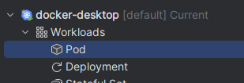

## Задача 5

Деплоймент: [Манифест](task3/task-5-deployment-and-svc.yaml)

Результат:   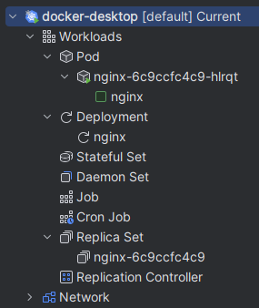

## Задача 6

Результат теста запущенного через деплоймент приложения:   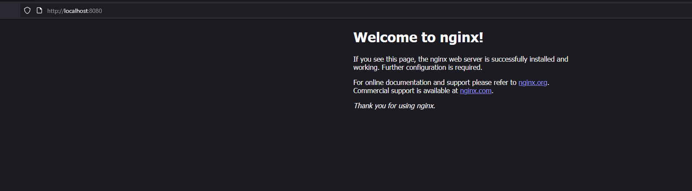

## Задача 7

Удаляем под, ожидаем, что создастся новый

До:   

После:   

## Задача 8

Масштабирование до 3 реплик и обратно на 1

Replica count = 3:   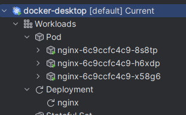

Replica count = 1:   
## Задача 9

Обновление версий образа в деплойменте

До:   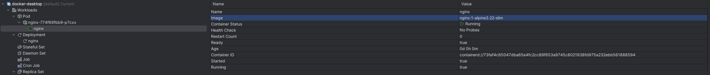

После:   

# Задание №4 по курсу JavaPRO Модуль 2

## Задача 1

Манифест: [1. daemon-set.yaml](task4/1.%20daemon-set.yaml)

Результат:

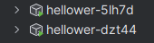

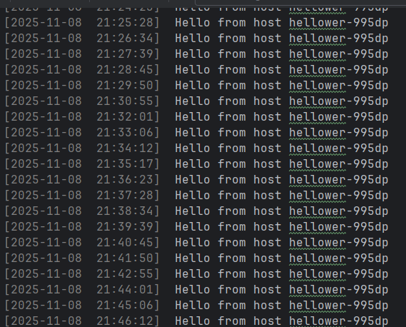

## Задача 2

Манифест: [2. stateful-set.yaml](task4/2.%20stateful-set.yaml)

Результат:

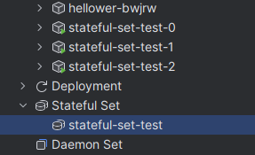

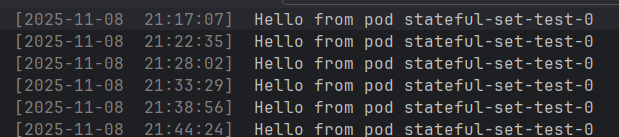

## Задача 3
Манифест: [3. job.yaml](task4/3.%20job.yaml)

Результат: 

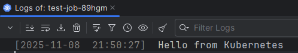

## Задача 4
### 4.1

Манифест: [4.1. cronjob.yaml](task4/4.1.%20cronjob.yaml)

Результат: 

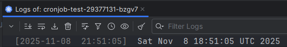

### 4.2

Манифест: [4.2. second cronjob.yaml](task4/4.2.%20second%20cronjob.yaml)

Результат:

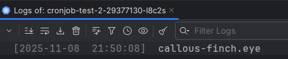

### 4.3

kubectl create job --from=cronjob/cronjob-test-2 manual-job-from-cronjob-2

Результат:

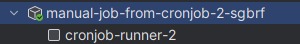