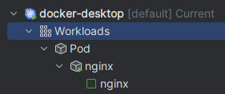
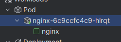
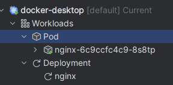
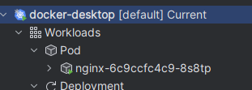
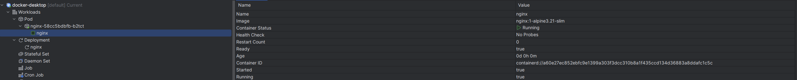

# Задание №3 по курсу JavaPRO Модуль 2

## Задание 1

K8S развёрнут на базе Docker Desktop

## Задание 2

Подготовлен манифест пода: [Манифест](task-2-simple-pod.yaml)

## Задание 3

Манифест применён, под запущен: [Результат выполнения манифеста](task-3-simple-pod-deployment-result.yaml)

## Задание 4

### Удаление пода
До удаления:   

После удаления:   

## Задание 5

Деплоймент: [Манифест](task-5-deployment-and-svc.yaml)

Результат:   

## Задание 6

Результат теста запущенного через деплоймент приложения:   

## Задание 7

Удаляем под, ожидаем, что создастся новый

До:   

После:   

## Задание 8

Масштабирование до 3 реплик и обратно на 1

Replica count = 3:   

Replica count = 1:   
## Задание 9

Обновление версий образа в деплойменте

До:   

После:   